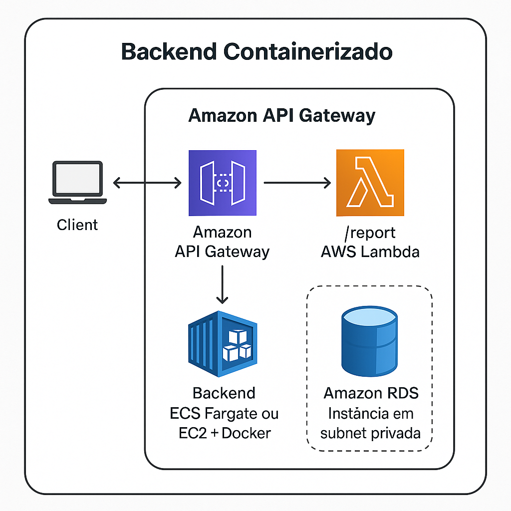

# 📦 Backend Containerizado com AWS

Este projeto apresenta uma aplicação backend containerizada e escalável, desenvolvida na disciplina **Serviços em Nuvem** sob orientação do professor **Daniel Zou**, por **Danilo Ye**. A solução utiliza os principais serviços da AWS, incluindo **ECS Fargate**, **Amazon RDS**, **API Gateway** e **AWS Lambda**.

## 📌 Descrição Geral

A arquitetura proposta segue uma abordagem segura e modular. As requisições dos usuários são processadas por um gateway de entrada e roteadas para uma API RESTful hospedada em contêineres. Uma função Lambda separada é responsável pela geração de relatórios sob demanda, consumindo a própria API via HTTP.

## 🔧 Tecnologias Utilizadas

- **Amazon ECS (Fargate)** – Execução dos contêineres backend
- **Amazon RDS (MySQL)** – Banco de dados relacional em sub-rede privada
- **Amazon API Gateway** – Roteamento de requisições para a API e Lambda
- **AWS Lambda** – Função serverless para a rota `/report`
- **Amazon CloudWatch** – Monitoramento de logs
- **Amazon ECR** – Armazenamento de imagem Docker
- **VPC, Sub-redes, NAT Gateway** – Infraestrutura de rede segura

## 🔄 Funcionalidades

### API RESTful (Node.js)

| Rota             | Método | Descrição                      |
|------------------|--------|--------------------------------|
| `/items`         | GET    | Lista todos os itens           |
| `/items`         | POST   | Cria um novo item              |
| `/items/{id}`    | PUT    | Atualiza um item existente     |
| `/items/{id}`    | DELETE | Remove um item                 |

### Relatório via Lambda

| Rota       | Método | Descrição                                |
|------------|--------|--------------------------------------------|
| `/report`  | GET    | Gera estatísticas com base nos dados da API |

## 🔐 Segurança

- O banco RDS não possui IP público
- O ECS Fargate opera em sub-redes privadas
- A comunicação entre serviços é controlada por grupos de segurança
- O acesso externo ocorre exclusivamente via API Gateway

## 🖥️ Diagrama da Arquitetura

## 📽️ Vídeo Demonstrativo

> O vídeo apresenta a execução das operações CRUD, a chamada à rota `/report`, e a arquitetura de serviços utilizada.  
> Disponível em: [link_do_video.mp4]

## 🧪 Testes e Logs

- Testes realizados via Postman
- Logs disponíveis no Amazon CloudWatch para a API e Lambda
- A função Lambda consome a API de forma desacoplada

## 👨‍💻 Autor

**Danilo Ye**  
Disciplina: *Serviços em Nuvem*  
Professor: *Daniel Zou*

---

